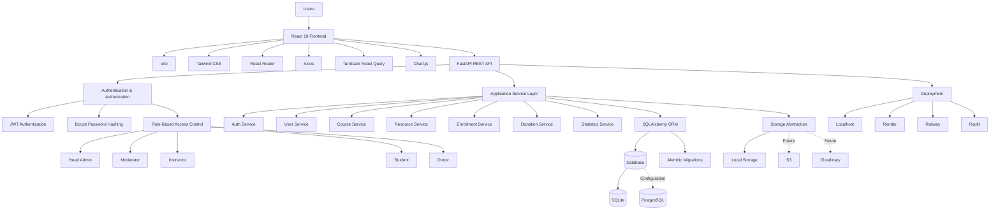
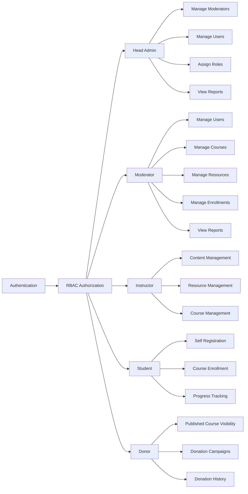
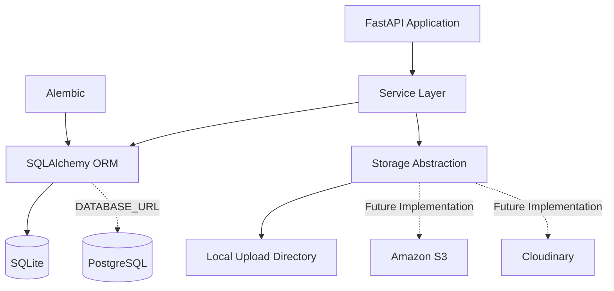
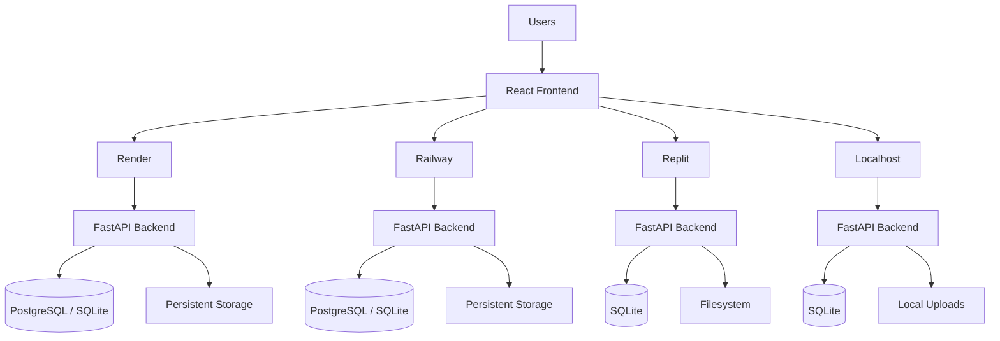

# NGO LMS

A production-ready Learning Management System built for NGOs — course delivery, role-based staff tools, fundraising management, and a responsive UI that works on everything from a phone to a large monitor.

---

## 📑 Table of Contents

* [Project Overview](#project-overview)
* [Technical Architecture](#technical-architecture)

  * [Architecture Overview](#architecture-overview)
  * [Architecture Documentation](#architecture-documentation)
  * [Architecture Layers](#architecture-layers)
  * [Role-Based Access Control](#role-based-access-control)
  * [Data & Storage Architecture](#data--storage-architecture)
  * [Deployment Architecture](#deployment-architecture)
* [Features](#features)
* [Technology Stack](#technology-stack)
* [Folder Structure](#folder-structure)
* [Prerequisites](#prerequisites)
* [Environment Variables](#environment-variables)
* [Running Locally](#running-locally)
* [Demo Data](#demo-data)
* [Troubleshooting](#troubleshooting)
* [Database Migrations](#database-migrations)
* [Deployment Guide](#deployment-guide)

  * [Localhost](#1-localhost)
  * [Render](#2-render)
  * [Railway](#3-railway)
  * [Replit](#4-replit)
* [API Documentation](#api-documentation)
* [Future Improvements](#future-improvements)

---

## 📌 Project Overview

NGO LMS lets an organization run courses for students while giving staff (Head Admin, Moderators, Instructors) the tools to manage users, content, and resources. Donors get read-only visibility into published courses.

The whole application is designed to run **unchanged** across localhost, Render, Railway, and Replit — only environment variables change between environments.

The database is **SQLite by default** (a single file, zero setup). If you ever want PostgreSQL or another database, you only change the `DATABASE_URL` — no code changes required, since the backend talks to the database exclusively through SQLAlchemy.

---

# 🏗️ Technical Architecture

NGO LMS follows a modular full-stack architecture designed around separation of concerns, role-based security, database abstraction, storage abstraction, and deployment portability.

The application is divided into the following major layers:

```text
┌─────────────────────────────────────────────────────────────┐
│                         NGO LMS                             │
├─────────────────────────────────────────────────────────────┤
│                    Presentation Layer                       │
│             React 19 + Vite + Tailwind CSS                 │
├─────────────────────────────────────────────────────────────┤
│                     API Communication                       │
│                Axios + TanStack React Query                │
├─────────────────────────────────────────────────────────────┤
│                      API Layer                              │
│                       FastAPI                              │
├─────────────────────────────────────────────────────────────┤
│               Authentication & Authorization                │
│                 JWT + bcrypt + RBAC                         │
├─────────────────────────────────────────────────────────────┤
│                    Service Layer                            │
│       Auth · Users · Courses · Resources · Donations        │
├─────────────────────────────────────────────────────────────┤
│                    Data Access Layer                        │
│                    SQLAlchemy ORM                           │
├─────────────────────────────────────────────────────────────┤
│                   Database Layer                            │
│                SQLite / PostgreSQL                          │
├─────────────────────────────────────────────────────────────┤
│                    Storage Layer                            │
│           Local Storage / Future S3 / Cloudinary            │
└─────────────────────────────────────────────────────────────┘
```

---

## 🔗 Architecture Documentation

The detailed visual and conceptual architecture of the NGO LMS is available in the external technical architecture document.

### 📐 View Technical Architecture

<p align="center">
  <a href="https://notebook.google.com/notebook/de7866e8-7124-4468-bd8a-fb1ce834b043/artifact/2506f020-c260-4a17-a9c1-43b632c701ca?utm_source=nlm_web_share&utm_medium=google_oo&utm_campaign=art_share_1&utm_content=&utm_smc=nlm_web_share_google_oo_art_share_1_" target="_blank">
    <strong>🚀 Open NGO LMS Technical Architecture →</strong>
  </a>
</p>

The architecture documentation covers:

* 🔐 Authentication and authorization
* 👥 Role-Based Access Control
* 🎓 Course → Module → Lesson hierarchy
* 📚 Learning resources
* 📝 Quizzes and assignments
* 🏆 Certificates and verification
* 💰 Donation campaigns
* 🤝 Donor engagement
* 📊 Administrative dashboards
* 🗄️ Database architecture
* 📦 Storage abstraction
* ☁️ Deployment architecture
* 📱 Responsive frontend architecture

---

## 🧱 Architecture Layers

| Layer                 | Technology                   | Responsibility                           |
| --------------------- | ---------------------------- | ---------------------------------------- |
| **Presentation**      | React 19, Vite, Tailwind CSS | User interface and interaction           |
| **Routing**           | React Router                 | Client-side navigation                   |
| **API Communication** | Axios, TanStack React Query  | API requests and server-state management |
| **API Layer**         | FastAPI                      | REST API endpoints                       |
| **Security**          | JWT, bcrypt, RBAC            | Authentication and authorization         |
| **Validation**        | Pydantic                     | Request and response validation          |
| **Business Logic**    | Service Layer                | Application rules and workflows          |
| **ORM**               | SQLAlchemy                   | Database abstraction                     |
| **Database**          | SQLite / PostgreSQL          | Persistent application data              |
| **Migration**         | Alembic                      | Database schema versioning               |
| **Storage**           | Local / S3 / Cloudinary*     | File and resource storage                |
| **Analytics**         | Chart.js + Statistics APIs   | Dashboards and reporting                 |
| **Deployment**        | Render / Railway / Replit    | Application hosting                      |

* S3 and Cloudinary implementations are planned future improvements.

---

## 🔄 Architecture Flow



---

## 🔐 Role-Based Access Control

NGO LMS implements Role-Based Access Control (RBAC) with five primary roles.



### Role Summary

| Role                 | Primary Responsibilities                                          |
| -------------------- | ----------------------------------------------------------------- |
| 👑 **Head Admin**    | System administration, moderators, permissions, users and reports |
| 🛡️ **Moderator**    | Users, courses, resources, enrollments and reports                |
| 👨‍🏫 **Instructor** | Courses, content and learning resources                           |
| 🎓 **Student**       | Registration, enrollment and progress tracking                    |
| 💝 **Donor**         | Published course visibility, campaigns and donation history       |

---

## 🗄️ Data & Storage Architecture

The backend communicates with the database through SQLAlchemy. This creates a layer of abstraction between application logic and the underlying database engine.



### Database Strategy

| Component               | Purpose                                    |
| ----------------------- | ------------------------------------------ |
| **SQLAlchemy**          | Database abstraction and ORM               |
| **SQLite**              | Default zero-setup development database    |
| **PostgreSQL**          | Production database option                 |
| **Alembic**             | Database schema migrations                 |
| **Storage Abstraction** | Decouples file storage from business logic |
| **Local Storage**       | Current development storage implementation |
| **S3 / Cloudinary**     | Planned scalable storage implementations   |

---

## ☁️ Deployment Architecture

The application is designed so the **same codebase** can be deployed to different environments. Deployment-specific behavior is controlled primarily through environment variables.



### Deployment Targets

| Environment   | Frontend    | Backend           | Database            | Primary Use        |
| ------------- | ----------- | ----------------- | ------------------- | ------------------ |
| **Localhost** | Vite        | Uvicorn / FastAPI | SQLite              | Development        |
| **Render**    | Static Site | Web Service       | PostgreSQL / SQLite | Deployment         |
| **Railway**   | Service     | FastAPI           | PostgreSQL / SQLite | Deployment         |
| **Replit**    | Node.js     | Python / FastAPI  | SQLite              | Development / Demo |

---

## 🧩 Architectural Principles

### 1. Separation of Concerns

Frontend, API routes, services, database models, schemas, and storage are separated into dedicated layers.

### 2. Role-Based Security

Access to application functionality is controlled according to the authenticated user's role and permissions.

### 3. Database Abstraction

The application communicates with relational databases through SQLAlchemy, reducing database-specific coupling.

### 4. Storage Abstraction

File handling is isolated behind a storage layer, allowing future migration from local storage to S3 or Cloudinary.

### 5. Environment Portability

Deployment-specific configuration is provided through environment variables rather than hard-coded application settings.

### 6. API-First Backend

The FastAPI backend exposes structured REST endpoints consumed by the React frontend.

### 7. Responsive Design

The frontend is designed to operate across mobile, tablet, laptop, and large-monitor form factors.

### 8. Migration-Driven Database Evolution

Alembic provides a reproducible mechanism for tracking and applying database schema changes.

---

## ✨ Features

* **Authentication** — JWT-based login/signup, password hashing (bcrypt), and a "forgot password" page that directs users to contact an administrator (no email sending in this phase).

* **RBAC** — Five roles: Head Admin, Moderator, Instructor, Student, Donor.

  * The Head Admin account is **seeded automatically** on first run.
  * Only the Head Admin can create Moderators and assign their permissions.
  * Students self-register.
  * Any user can later be promoted to another role by the Head Admin.

* **Courses** — Courses → Modules → Lessons hierarchy, publish/unpublish, student self-enrollment with progress tracking.

* **Resources** — Upload videos, images, PDF, DOCX, PPT, ZIP files, or attach external links (YouTube, Google Drive, Dropbox, OneDrive, Vimeo, or any public URL).

* **Course Categories** — Staff can create categories and tag courses; the course catalog can be filtered by category.

* **Quizzes** — Staff build quizzes per course with multiple-choice, true/false, and short-answer questions; students take them and get an instant auto-graded score and pass/fail result.

* **Assignments** — Staff post assignments per lesson with instructions; students upload a submission file; staff review submissions and enter a grade and feedback.

* **Certificates** — Staff issue a certificate to any enrolled student for a course; each certificate gets a unique verification code.

* **Donations & Campaigns** — Staff create fundraising campaigns with a goal amount; donors browse and donate, with a live progress bar and their own donation history.

* **Rich Dashboards** — Head Admin/Moderator dashboards provide KPI cards and charts for registration trends, users by role, active/inactive users, and course status.

* **Storage Abstraction** — Files are saved through a swappable storage backend. Local disk today; S3 or Cloudinary can be added later.

* **Fully Responsive UI** — Responsive tables, forms, cards, charts, navigation and touch-friendly controls.

---

## 🛠️ Technology Stack

### Frontend

* React 19
* Vite
* Tailwind CSS
* React Router
* Axios
* React Hook Form
* TanStack React Query
* Chart.js

### Backend

* Python
* FastAPI
* SQLAlchemy ORM
* Alembic
* JWT / python-jose
* Pydantic
* Pydantic Settings
* bcrypt

### Database

* SQLite by default
* PostgreSQL supported through SQLAlchemy configuration

### Storage

* Local uploads in development
* Storage abstraction for future Cloudinary / S3 integration

---

## 📁 Folder Structure

```text
ngo-lms/
├── backend/
│   ├── app/
│   │   ├── core/               # Config, database, security, RBAC dependencies
│   │   ├── models/             # SQLAlchemy models
│   │   ├── schemas/            # Pydantic schemas
│   │   ├── routers/            # FastAPI routers
│   │   ├── services/           # Business logic
│   │   ├── middleware/         # Custom middleware
│   │   ├── utils/              # Shared helpers
│   │   ├── seed.py             # Seeds Head Admin
│   │   └── main.py             # FastAPI entrypoint
│   ├── alembic/                # Database migrations
│   ├── uploads/                # Local file storage
│   ├── requirements.txt
│   └── .env.example
│
├── frontend/
│   ├── src/
│   │   ├── api/                # Axios instance + API wrappers
│   │   ├── components/
│   │   │   ├── layout/         # Sidebar, Navbar, DashboardLayout
│   │   │   └── ui/             # Reusable UI components
│   │   ├── context/            # AuthContext
│   │   ├── pages/              # Application pages
│   │   └── styles/             # Tailwind entrypoint
│   ├── index.html
│   ├── vite.config.js
│   ├── tailwind.config.js
│   └── .env.example
│
└── README.md
```

---

## 📋 Prerequisites

* **Node.js** 18+ and npm
* **Python** 3.11+
* **Git**

No database server is required for local development — SQLite ships with Python.

---

## 🔐 Environment Variables

### Backend

Create `backend/.env` from `backend/.env.example`.

| Variable                      | Description                  | Local Default            |
| ----------------------------- | ---------------------------- | ------------------------ |
| `DATABASE_URL`                | SQLAlchemy connection string | `sqlite:///./ngo_lms.db` |
| `SECRET_KEY`                  | JWT signing secret           | Development placeholder  |
| `ALGORITHM`                   | JWT algorithm                | `HS256`                  |
| `ACCESS_TOKEN_EXPIRE_MINUTES` | Access token lifetime        | `60`                     |
| `REFRESH_TOKEN_EXPIRE_DAYS`   | Refresh token lifetime       | `7`                      |
| `CORS_ORIGINS`                | Allowed frontend origins     | `http://localhost:5173`  |
| `STORAGE_DRIVER`              | Storage implementation       | `local`                  |
| `UPLOAD_DIR`                  | Uploaded files directory     | `uploads`                |
| `MAX_UPLOAD_MB`               | Maximum upload size          | `200`                    |
| `HEAD_ADMIN_EMAIL`            | Seeded admin email           | `.env.example`           |
| `HEAD_ADMIN_PASSWORD`         | Seeded admin password        | `.env.example`           |
| `HEAD_ADMIN_NAME`             | Seeded admin name            | `.env.example`           |

### Frontend

| Variable            | Description        |
| ------------------- | ------------------ |
| `VITE_API_BASE_URL` | Backend API origin |

Leave it empty in development when Vite proxies `/api`.

---

## 🚀 Running Locally

```bash
# 1. Clone the repository
git clone <your-fork-or-repo-url> ngo-lms
cd ngo-lms

# 2. Backend setup
cd backend

python -m venv .venv

# macOS/Linux
source .venv/bin/activate

# Windows
.venv\Scripts\activate

pip install -r requirements.txt

# macOS/Linux
cp .env.example .env

# Windows cmd
copy .env.example .env

# Windows PowerShell
Copy-Item .env.example .env

# 3. Database migrations
alembic upgrade head

# 4. Run backend
uvicorn app.main:app --reload --port 8000

# Backend
http://localhost:8000

# Swagger
http://localhost:8000/docs

# 5. Frontend
cd ../frontend

npm install

# macOS/Linux
cp .env.example .env

# Windows cmd
copy .env.example .env

# Windows PowerShell
Copy-Item .env.example .env

# 6. Run frontend
npm run dev

# Frontend
http://localhost:5173
```

The Head Admin account is created automatically on first startup.

### Windows Note

If `python` or `python3` is not recognized, install Python from [python.org](https://www.python.org/downloads/) and ensure **Add Python to PATH** is enabled.

Alternatively:

```powershell
py -m venv .venv
```

---

## 🧪 Demo Data

The application starts empty except for the Head Admin account.

To populate the application with realistic sample data:

```bash
cd backend

python -m app.seed_demo_data
```

The demo seed includes:

* Courses
* Quizzes
* Enrollments
* Certificates
* Donation campaigns
* Donations
* Forum posts
* Blog posts
* Demo users

The command is safe to run more than once because it checks for an existing marker user before creating demo data.

### Demo Accounts

All seeded accounts share the password:

```text
Demo@123
```

| Role       | Email                            |
| ---------- | -------------------------------- |
| Head Admin | Configured in `backend/.env`     |
| Moderator  | `rohit.mod@demo.ngo-lms.test`    |
| Instructor | `arjun.inst@demo.ngo-lms.test`   |
| Student    | `priya.sharma@demo.ngo-lms.test` |
| Donor      | `donor0@demo.ngo-lms.test`       |

---

## 🔧 Troubleshooting

### bcrypt / passlib error

If you encounter:

```text
ValueError: password cannot be longer than 72 bytes
```

or an error involving bcrypt versions, reinstall the project's dependencies in a fresh virtual environment.

This project hashes passwords using bcrypt directly.

```bash
pip install -r requirements.txt
```

If necessary, delete `.venv` and recreate the environment.

### `cp` is not recognized on Windows

Use:

```cmd
copy .env.example .env
```

or PowerShell:

```powershell
Copy-Item .env.example .env
```

---

## 🗃️ Database Migrations

After changing a database model:

```bash
cd backend

# Generate migration
alembic revision --autogenerate -m "describe your change"

# Apply migration
alembic upgrade head

# Roll back one revision
alembic downgrade -1
```

During early development, `Base.metadata.create_all()` can create the SQLite database automatically.

Once schema changes begin, Alembic migrations should be used so database changes remain tracked and reproducible.

---

# ☁️ Deployment Guide

The application is designed so the **same codebase** can run across multiple deployment environments. Only environment variables and platform configuration change.

---

## 1. Localhost

Local development is covered in the [Running Locally](#running-locally) section.

---

## 2. Render

### Backend

Create a new Render Web Service:

```text
Root Directory:
backend

Build Command:
pip install -r requirements.txt

Start Command:
uvicorn app.main:app --host 0.0.0.0 --port $PORT
```

Configure the environment variables from:

```text
backend/.env.example
```

Set a strong production `SECRET_KEY`.

Set:

```text
CORS_ORIGINS=https://<your-frontend>.onrender.com
```

### Database

SQLite can be used for a quick demonstration, but Render's ephemeral filesystem should not be relied upon for persistent production data.

For persistent production deployments, use PostgreSQL and set:

```text
DATABASE_URL=<postgresql-connection-string>
```

No application-code changes are required because the backend uses SQLAlchemy.

### Frontend

Create a Render Static Site:

```text
Root Directory:
frontend

Build Command:
npm install && npm run build

Publish Directory:
dist
```

Set:

```text
VITE_API_BASE_URL=https://<your-backend>.onrender.com
```

### Common Render Issues

**CORS errors**

Ensure `CORS_ORIGINS` exactly matches the frontend URL.

**Application failed to respond**

Ensure the backend binds to:

```text
0.0.0.0
```

and uses:

```text
$PORT
```

**Uploaded files disappear**

Use persistent storage instead of ephemeral local disk.

---

## 3. Railway

### Backend

Deploy the repository and set:

```text
Root Directory:
backend
```

Railway should detect Python automatically.

Start command:

```bash
uvicorn app.main:app --host 0.0.0.0 --port $PORT
```

Configure the same environment variables used by the Render backend.

### Frontend

Create a frontend service:

```text
Root Directory:
frontend
```

Build:

```bash
npm install && npm run build
```

If using a Node static server:

```bash
npx serve -s dist -l $PORT
```

Set:

```text
VITE_API_BASE_URL=https://<your-backend>.up.railway.app
```

### PostgreSQL

Add a PostgreSQL service/plugin and configure:

```text
DATABASE_URL=<railway-postgresql-url>
```

### Common Railway Issue

If the build succeeds but the service crashes, ensure the application reads the dynamically assigned:

```text
$PORT
```

instead of using a hard-coded production port.

---

## 4. Replit

The application can be deployed using two Repls or a single Repl with multiple run configurations.

### Backend

```bash
pip install -r requirements.txt

uvicorn app.main:app --host 0.0.0.0 --port 8000
```

### Frontend

```bash
npm install

npm run dev -- --host 0.0.0.0
```

Configure environment variables using Replit Secrets.

Set:

```text
VITE_API_BASE_URL=<backend-public-url>
```

and configure:

```text
CORS_ORIGINS=<frontend-public-url>
```

SQLite works as-is, but the filesystem should be treated as development/demo storage when persistence across redeployments is not guaranteed.

---

# 🔌 API Documentation

Interactive API documentation is automatically generated by FastAPI.

### Swagger UI

```text
http://localhost:8000/docs
```

### ReDoc

```text
http://localhost:8000/redoc
```

---

## API Endpoint Summary

| Method | Endpoint                                 | Description                   | Auth              |
| ------ | ---------------------------------------- | ----------------------------- | ----------------- |
| POST   | `/api/auth/signup`                       | Student self-registration     | No                |
| POST   | `/api/auth/login`                        | Login and receive tokens      | No                |
| POST   | `/api/auth/forgot-password`              | Contact administrator message | No                |
| GET    | `/api/auth/me`                           | Current authenticated user    | Yes               |
| GET    | `/api/users`                             | List users                    | Head Admin        |
| POST   | `/api/users/moderators`                  | Create Moderator              | Head Admin        |
| PATCH  | `/api/users/moderators/{id}/permissions` | Update Moderator permissions  | Head Admin        |
| PATCH  | `/api/users/{id}/role`                   | Change user role              | Head Admin        |
| PATCH  | `/api/users/{id}/active`                 | Activate/deactivate user      | Head Admin        |
| GET    | `/api/courses`                           | List courses                  | Yes               |
| GET    | `/api/courses/{id}`                      | Course details                | Yes               |
| POST   | `/api/courses`                           | Create course                 | Staff             |
| POST   | `/api/courses/{id}/publish`              | Publish course                | Staff             |
| POST   | `/api/courses/{id}/unpublish`            | Unpublish course              | Staff             |
| POST   | `/api/courses/{id}/modules`              | Add module                    | Staff             |
| POST   | `/api/courses/modules/{id}/lessons`      | Add lesson                    | Staff             |
| POST   | `/api/resources/upload`                  | Upload resource               | Staff             |
| POST   | `/api/resources/link`                    | Attach external link          | Staff             |
| POST   | `/api/enrollments/{course_id}`           | Student enrollment            | Student           |
| GET    | `/api/enrollments/me`                    | Student enrollments           | Yes               |
| GET    | `/api/stats/users`                       | User statistics               | Admin / Moderator |
| GET    | `/api/stats/courses`                     | Course statistics             | Admin / Moderator |
| GET    | `/api/users/export.csv`                  | Export users                  | Head Admin        |
| GET    | `/api/donations/campaigns`               | Donation campaigns            | Yes               |
| POST   | `/api/donations/campaigns`               | Create campaign               | Admin / Moderator |
| POST   | `/api/donations/campaigns/{id}/donate`   | Make donation                 | Donor             |
| GET    | `/api/donations/summary`                 | Donation statistics           | Admin / Moderator |
| GET    | `/api/health`                            | Health check                  | No                |

For complete request/response bodies and examples, use the Swagger UI at `/docs`.

---

# 🚀 Future Improvements

The following features are planned or can be expanded in future development iterations:

* Events & announcements module
* PDF export
* Audit logs / activity feed
* Notification center
* Global search
* Real-time updates using WebSockets
* Dark mode
* Dashboard widget customization
* Payment gateway integration for real donations
* Email-based password reset
* S3 / Cloudinary storage backend implementations
* Automatic course progress tracking
* Refresh-token rotation
* Logout / token blacklist endpoint
* Automated backend tests using pytest
* Frontend tests using Vitest / React Testing Library
* CI pipeline with linting and automated tests

---

## 📊 Project Architecture at a Glance

```text
                           ┌───────────────────┐
                           │      USERS        │
                           └─────────┬─────────┘
                                     │
                                     ▼
                         ┌───────────────────────┐
                         │   REACT FRONTEND     │
                         │ React + Vite +       │
                         │ Tailwind + Router    │
                         └───────────┬───────────┘
                                     │
                                  REST API
                                     │
                                     ▼
                         ┌───────────────────────┐
                         │     FASTAPI API      │
                         └───────────┬───────────┘
                                     │
                ┌────────────────────┼────────────────────┐
                │                    │                    │
                ▼                    ▼                    ▼
        ┌──────────────┐     ┌──────────────┐     ┌──────────────┐
        │     AUTH     │     │   SERVICES   │     │    RBAC      │
        │ JWT + bcrypt │     │ Business     │     │ 5 Roles      │
        └──────────────┘     │ Logic        │     └──────────────┘
                             └──────┬───────┘
                                    │
                                    ▼
                          ┌──────────────────┐
                          │   SQLAlchemy     │
                          │      ORM         │
                          └────────┬─────────┘
                                   │
                    ┌──────────────┴──────────────┐
                    │                             │
                    ▼                             ▼
             ┌──────────────┐             ┌──────────────┐
             │   SQLite /   │             │   Storage    │
             │ PostgreSQL   │             │ Abstraction  │
             └──────────────┘             └──────┬───────┘
                                                 │
                                     ┌───────────┴───────────┐
                                     │                       │
                                     ▼                       ▼
                               Local Storage         Future S3 /
                                                      Cloudinary
```

---

## 📐 Technical Architecture Reference

For the complete visual architecture and supporting technical documentation:

**[🚀 Open NGO LMS Technical Architecture](https://notebook.google.com/notebook/de7866e8-7124-4468-bd8a-fb1ce834b043/artifact/2506f020-c260-4a17-a9c1-43b632c701ca?utm_source=nlm_web_share&utm_medium=google_oo&utm_campaign=art_share_1&utm_content=&utm_smc=nlm_web_share_google_oo_art_share_1_)**

---

## 📄 License

This project is developed as an NGO-focused Learning Management System.
